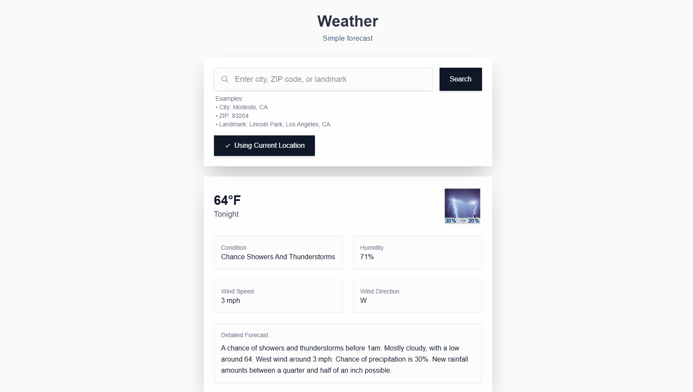

# Weather App

A beautiful, modern weather application built with Next.js and powered by the National Weather Service (NWS) API. Get accurate weather forecasts for any US location, including cities, ZIP codes, landmarks, and geographic features.



## Features

- 🌍 **Location Support**:
  - Cities and States (e.g., "Modesto, CA")
  - ZIP Codes (e.g., "83204")
  - Counties (e.g., "Valley County, MT")
  - Geographic Features (e.g., "Lake Youngs, WA", "Lincoln Park, Los Angeles, CA")
  - Automatic Current Location Detection

- 🌤 **Weather Information**:
  - Current Temperature
  - Weather Conditions
  - Humidity Levels
  - Wind Speed and Direction
  - Detailed Forecast

- 💅 **User Interface**:
  - Modern, Clean Design
  - Dark/Light Mode Support
  - Responsive Layout
  - Loading States
  - Error Handling
  - Beautiful Weather Icons

- 📱 **Progressive Web App (PWA)**:
  - Install on any device
  - Offline support
  - App-like experience
  - Fast loading
  - Background updates
  - Push notifications (coming soon)

## Tech Stack

- [Next.js 15](https://nextjs.org/) - React Framework
- [Bun](https://bun.sh/) - JavaScript Runtime & Package Manager
- [TypeScript](https://www.typescriptlang.org/) - Type Safety
- [Tailwind CSS](https://tailwindcss.com/) - Styling
- [HeroUI](https://heroui.com/) - UI Components
- [National Weather Service API](https://www.weather.gov/documentation/services-web-api) - Weather Data
- Service Workers - PWA Support

## Getting Started

### Prerequisites

- [Bun](https://bun.sh/) installed on your machine
- A text editor (e.g., VS Code)

### Installation

1. Clone the repository:
   ```bash
   git clone https://github.com/yourusername/weather-app.git
   cd weather-app
   ```

2. Install dependencies:
   ```bash
   bun install
   ```

3. Create a `.env.local` file:
   ```bash
   cp env.local.example .env.local
   ```

4. Update the environment variables in `.env.local`:
   ```
   NEXT_PUBLIC_NWS_USER_AGENT="your-app-name (your-email@example.com)"
   NEXT_PUBLIC_NWS_API_BASE_URL="https://api.weather.gov"
   GEOCODE_API_KEY="your-geocode-xyz-api-key"
   ```

5. Start the development server:
   ```bash
   bun dev
   ```

6. Open [http://localhost:3000](http://localhost:3000) in your browser.

### Installing as a PWA

1. Open the website in a supported browser (Chrome, Edge, Safari, etc.)
2. Look for the "Install" or "Add to Home Screen" option in your browser
3. Follow the prompts to install the app
4. The app will now be available on your device's home screen

## API Usage

The app uses two main APIs:

1. **National Weather Service (NWS) API**
   - Free to use
   - Requires User-Agent header
   - Provides detailed weather data for US locations

2. **Geocode.xyz API**
   - Used for location geocoding
   - Requires API key
   - Converts location names to coordinates

## PWA Features

- **Offline Support**: Basic functionality works without internet
- **Install Prompt**: Easy installation on supported devices
- **Fast Loading**: Caches resources for quick access
- **Auto Updates**: Automatically updates when new versions are available
- **Responsive**: Works on all screen sizes
- **Native-like**: Feels like a native app

## Contributing

Contributions are welcome! Please feel free to submit a Pull Request.

## Support

If you find this project helpful, consider supporting the developer:
[Support Link](https://moikas.com/discount/moikapy)

## License

This project is licensed under the MIT License - see the [LICENSE](LICENSE) file for details.

The MIT License is a permissive license that is short and to the point. It lets people do anything they want with your code as long as they provide attribution back to you and don't hold you liable. This means:

- ✅ Commercial use
- ✅ Modification
- ✅ Distribution
- ✅ Private use
- ✅ Sublicensing

The only requirements are:
- Keep the copyright notice
- Include the license text
- Provide attribution

## Acknowledgments

- Weather data provided by [National Weather Service](https://www.weather.gov/)
- Geocoding services by [Geocode.xyz](https://geocode.xyz/)
- Icons and design inspiration from various open-source projects
